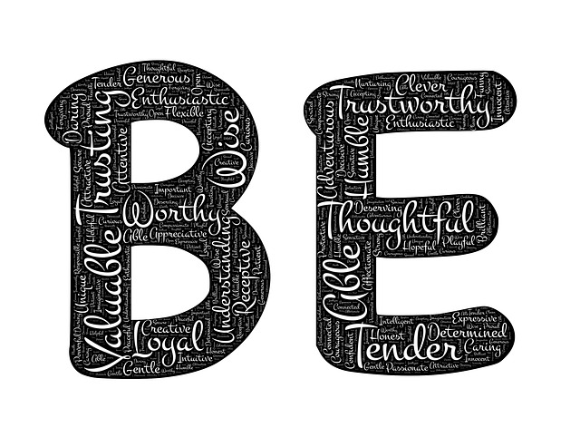

# sagarhtml
<!DOCTYPE html>
<html lang="en">

<head>
<meta charset="UTF-8">
<meta name="viewport" content="width=device-width, initial-scale=1">
  <link rel="stylesheet" href="https://www.w3schools.com/w3css/4/w3.css">
<link rel="stylesheet" href="https://fonts.googleapis.com/css?family=Oswald">
<link rel="stylesheet" href="https://fonts.googleapis.com/css?family=Open Sans">
<link rel="stylesheet" href="https://cdnjs.cloudflare.com/ajax/libs/font-awesome/4.7.0/css/font-awesome.min.css">
<link rel="stylesheet" href="https://maxcdn.bootstrapcdn.com/bootstrap/3.3.7/css/bootstrap.min.css">
  
  
</head>
<title>Book Store </title>
<link rel="shortcut icon" href="image/book.jpg" />

<body>
<body class="w3-light-grey">

<!-- Navigation bar with social media icons -->

<nav class="navbar navbar-default navbar-fixed-top">

  

  
  <ul class="nav navbar-nav navbar-right">
   <li class="list"><a href="index.htm">HOME(current)</a></li>
        <li class="list"><a href="#about">ABOUT</a></li>
        <li class="list"><a href="#service">SERVICES</a></li>
        <li class="list"><a href="#contact">CONTACT</a></li>
      </ul>
	  

</nav>

  <!-- Header -->
  <header class="w3-container w3-center w3-padding-48 w3-white">
    <h1 class="w3-xxxlarge"><b>Welcome to my Book Store</b></h1>
    <h6>Designed by:Sagar Basnet</h6>
  </header>
  <!-- image header --> 
  

  
  <h1>BOOK STORE</h1> 
  
Get your books
 
  <form class="form-inline">
    

      <input type="email" class="form-control" size="50" placeholder="Email Address" required>
      

        <button type="button" class="btn btn-danger">Subscribe</button>
      

	  
    

	 
	 
	 
	
	<button type="button" class="btn btn-info btn-lg" data-toggle="modal" data-target="#myModal">Login</button>

  </form>

 <h2>
What our admin says
</h2>
 

  

    <!-- Indicators -->
    <ol class="carousel-indicators">
      <li data-target="#myCarousel" data-slide-to="0" class="active"></li>
      <li data-target="#myCarousel" data-slide-to="1"></li>
      <li data-target="#myCarousel" data-slide-to="2"></li>
    </ol>

    <!-- Wrapper for slides -->
    

      

        <h4>"This site is the best. It provides u usuable books!" Sagar Basnet, Admin</h4>
      

      

        <h4>"One word... WOW!!" Siddhartha Karki,Editor</h4>
      

      

        <h4>"Best site for books" Luvina Sharma, Editor</h4>
      

    

    <!-- Left and right controls -->
    <a class="left carousel-control" href="#myCarousel" role="button" data-slide="prev">
      
      Previous
    </a>
    <a class="right carousel-control" href="#myCarousel" role="button" data-slide="next">
      
      Next
    </a>
  

 

 <!-- Container (The Band Section) -->

  <h3>ABOUT US</h3>
  
<em>We provide all of the books for your courses!</em>

  

  
   
  

    

      
<strong>Sagar Basnet</strong>
 
      
	   
	   
      

        
Leader Admin

        
B.Sc.CSIT Student

        
Admin since 2017

      

    

    

      
<strong>Siddhartha Karki</strong>
 
      
	   
	   
      

        
Co-leader Admin

        
B.Sc.CSIT Student

        
Admin since 2017

      

    

    

      
<strong>Luvina Sharma</strong>
 
      
	   
	   
      

        
Co-leader Admin

        
B.Sc.CSIT Student

        
Admin since 2017

      

    

  

 <!-- services -->
 

 <h2>
 Available Books
</h2>
  

    

      

        <a href="image/book3.jpg" target="_blank">
          
          

            
Lorem ipsum donec id elit non mi porta gravida at eget metus.

          

        </a>
      

    

    

      

        <a href="image/book4.png" target="_blank">
          
          

            
Lorem ipsum donec id elit non mi porta gravida at eget metus.

          

        </a>
      

    

    

      

        <a href="image/book5.jpg" target="_blank">
          
          

            
Lorem ipsum donec id elit non mi porta gravida at eget metus.

          

        </a>
      

    

  

<!-- Container (Contact Section) -->

  <h3 class="text-center">Contact</h3>
  
<em>Want update for Books!</em>

  

    

      
Need Books? Drop a note.

      
Biratnagar-01, Morang, Nepal

      
Phone: +9779816732840

      
Email: sagarbasnet1000@gmail.com

    

    

      

        

          <input class="form-control" id="name" name="name" placeholder="Name" type="text" required>
        

        

          <input class="form-control" id="email" name="email" placeholder="Email" type="email" required>
        

      

      <textarea class="form-control" id="comments" name="comments" placeholder="Comment" rows="5"></textarea>
       
      

        

          <button class="btn pull-right" type="submit">Send</button>
        

      

    

  

  <!-- popup model for sign up -->
  

  <!-- Modal -->
  

    

    
      <!-- Modal content-->
      

        

          <button type="button" class="close" data-dismiss="modal">&times;</button>
          <h4> Login</h4>
        

        

          <form role="form">
            

              <label for="usrname"> Username</label>
              <input type="text" class="form-control" id="usrname" placeholder="Enter email">
            

            

              <label for="psw"> Password</label>
              <input type="text" class="form-control" id="psw" placeholder="Enter password">
            

            

              <label><input type="checkbox" value="" checked>Remember me</label>
            

              <button type="submit" class="btn btn-success btn-block"> Login</button>
          </form>
        

        

          <button type="submit" class="btn btn-danger btn-default pull-left" data-dismiss="modal"> Cancel</button>
          
Not a member?  <button type="button" class="btn btn-info btn-lg" data-toggle="modal" data-target="#myModals">Sign Up</button>

          
Forgot <a href="#">Password?</a>

        

      

      
    

  
 

 

   <!-- Modal -->
  

    

    
      <!-- Modal content-->
      

        

          <button type="button" class="close" data-dismiss="modal">&times;</button>
          <h4 class="modal-title">Modal Header</h4>
        

        

          
Some text in the modal.

        

        

          <button type="button" class="btn btn-default" data-dismiss="modal">Close</button>
        

      

      
    

  

  

<footer style="background-color:black;color:white;height:30px;">

copyright @ www.bookstore.com

</footer>
   
   

</body>
</html>
